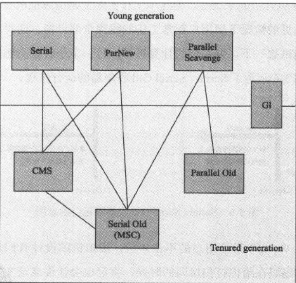

### GC回收算法  
作用：标记，处理（清除(sweep), 拷贝(copy)，整理(compact)） 

#### 标记 
1. 引用计数法  
优点：实现简单，判定效率高  
缺点：难以解决对象之间循环引用问题  

2. 可达性分析算法（Roots and Reachability）  
  通过"GC Roots"对象为搜索起点，搜索所走过的路径成为引用链，当对象到GC Roots没有引用链，则证明对象不可用  

JAVA中可作为GC Roots的对象包括：  
> 1. 虚拟机栈中的引用对象
> 2. 方法区中静态属性引用的对象
> 3. 方法区中常量引用的对象
> 4. 本地方法栈中JNI(即native方法)引用的对象

#### 处理  
1. 标记清除算法(mark-sweep)  
   1. 标记所有需要回收的对象，在标记完成后同意回收被标记的对象  
   2. 不足：效率不高，产生碎片  
2. 标记复制（标记拷贝）算法(mark-copy)   
   1. 事先把内存分为相等的两块内存（A,B），使用其中一块(A)，gc完成时把幸存的对象整齐的拷贝到另一块(B)，在继续使用（B）分配新对象，下次gc后在使用（A），以此类推  
   2. 实现简单，运行高效，但是浪费内存
   3. 现代虚拟机中新生代中使用较多，一般默认Eden:S0:S1 = 8:1:1  
3. 标记整理算法(mark-compact)  
   1.  标记完与复制算法一致，标记完把存活对象往一端移动，然后清楚端边界的内存  
   2. 不足：整理耗时  
   3. 老年代中使用较多

#### 分代收集器 
主要是分为串行（serial），并行（parallel），并发（concurrent）三个大的类别  

##### **young genetation**
1. Serial(mark-copy):stop the world,然后单线程收集,可以配合CMS,client模式青年代默认算法，GC日志关键字：DefNew(Default New Generation)  
2. ParNew(mark-copy):stop the world,然后多线程收集,可以配合CMS，server模式青年代默认算法，GC日志关键字：ParNew(Parallel New Generation)  
3. Parallel Scavenge(mark-copy):stop the world,有限制的多线程收集，不能和CMS组合，关注吞吐量，GC日志关键字：PSYoungGen  

##### **old generation**
1. Concurrent Mark Sweep(mark-sweep as title):部分 stop the world,多线程收集  
2. Serial Old(mark-compact): stop the world,单线程收集，CMS备选方案，GC日志关键字：Tenured  
3. Parallel Old(mark-compact):stop the world,多线程收集，只能和Parallel Scavenge组合使用，GC日志关键字：ParOldGen  

##### **G1**
将java heap 划分为多个 region。 整体上看 是 mark-compact 局部上看(region之间)上看 是 mark-copy  

##### 各种收集器的组合方式  

### 参考  
1. 《深入理解Java虚拟机》  
2. [Major GC和Full GC的区别是什么？触发条件呢？](https://www.zhihu.com/question/41922036/answer/93079526)